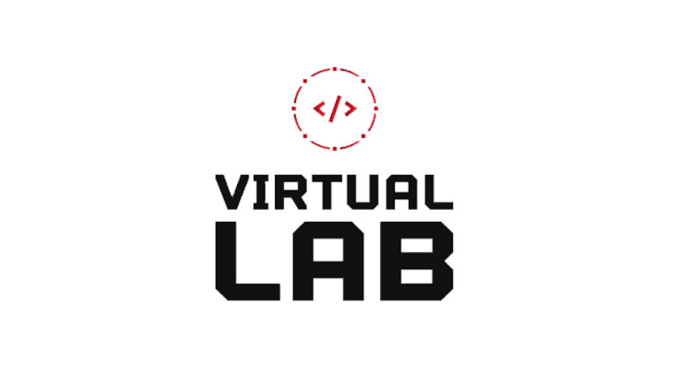

<p align="center">
  <a href="" rel="noopener">
    </a>
</p>
<h3 align="center">Virtual Lab</h3>

---

<p align="center"> A desktop application for students to simulate three of the A-Level Physics practical tasks.
</p>

## 📝 Table of Contents

- [📝 Table of Contents](#-table-of-contents)
- [💡 Idea ](#-idea-)
- [🏁 Getting Started](#-getting-started-)
  - [Prerequisites](#prerequisites)
  - [Installation](#installation)
- [🎈 Usage](#-usage-)
- [⛏️ Built With](#️-built-with-)

## 💡 Idea <a name = "idea"></a>

- Students often struggle with completing the practical tasks, due to difficulty of understanding and setting up the experiments.
- During development of this project, COVID restrictions meant students could not attent school to attempts the practicals.
- This application includes two major features:
  - Example animations for each practical, detailing the setup required and measurements to take
  - DIY feature for each practical to allow students to attempt the experiement themselves
- The main aim is to provide a platform for students to learn and attempt the practicals at home
- This project was done as part of the A-Level Computer Science NEA coursework 

## 🏁 Getting Started <a name = "getting_started"></a>

These instructions will get you a copy of the project up and running on your local machine for development and testing purposes.

### Prerequisites

You will need to have the following software installed on your machine:
- [Python](https://www.python.org/)
- [PyQt5](https://pypi.org/project/PyQt5/)
- [Matplotlib](https://matplotlib.org/)
- [NumPy](https://numpy.org/)

### Installation

Clone the repository to your local machine:

```bash
git clone https://github.com/ayazb7/Virtual-Lab.git
cd Virtual-Lab
```

Install the dependencies:

```bash
pip install PyQt5 matplotlib numpy
```

## 🎈 Usage <a name="usage"></a>

To run the application, execute the following command:

```bash
python VirtualLab.py
```

## ⛏️ Built With <a name = "built_with"></a>

- [PyQt5](https://pypi.org/project/PyQt5/) - Python bindings for Qt libraries
- [Matplotlib](https://matplotlib.org/) - Plotting library for Python
- [NumPy](https://numpy.org/) - Library for numerical computations
